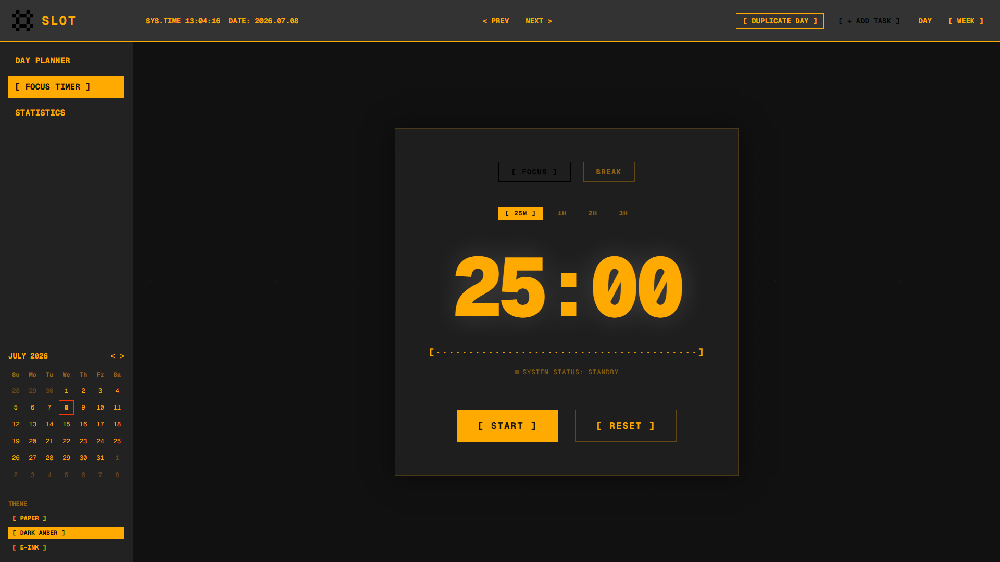

<p align="center">
  
</p>

<h1 align="center">SLOT</h1>

<p align="center">
  <strong>A highly interactive, offline-first time management application with a strict Retro Sci-Fi terminal aesthetic.</strong>
</p>

## Overview

**SLOT** is a modern calendar, time-blocking tool, and Pomodoro focus timer wrapped in a brutalist, retro-futuristic terminal UI. It features a drag-and-drop grid system allowing you to effortlessly organize your day, track your deep work hours, and analyze your productivity streaks.

<p align="center">
  
</p>

<p align="center">
  
</p>

## Features

- **Retro Terminal UI**: Sharp edges, Geist Mono typography, three distinct terminal themes (Paper, Dark Amber, E-Ink).
- **Drag & Drop Planner**: Seamlessly move and resize time blocks across days and hours using `@dnd-kit`.
- **Focus Timer**: A dedicated Pomodoro mode with deep work duration presets (25m, 1h, 2h, 3h).
- **Audio Notifications**: Authentic Web Audio API square-wave terminal beeps when timers complete.
- **Productivity Dashboard**: Track your task completion rate and deep work hours with a GitHub-style 90-day heatmap.
- **Offline PWA Support**: Installable on desktop and mobile. Works 100% offline via local storage and Service Worker caching.

## Tech Stack

- **Framework**: [Next.js 15](https://nextjs.org/) (App Router)
- **Styling**: [Tailwind CSS 4](https://tailwindcss.com/)
- **State Management**: [Zustand](https://zustand-demo.pmnd.rs/)
- **Drag & Drop**: [dnd-kit](https://dndkit.com/)
- **Dates**: [date-fns](https://date-fns.org/)

## Getting Started

First, run the development server:

```bash
npm run dev
# or
yarn dev
# or
pnpm dev
# or
bun dev
```

Open [http://localhost:3000](http://localhost:3000) with your browser to see the application in action.

## Deployment

This app is optimized for instantaneous deployment on [Vercel](https://vercel.com/new). Since it relies exclusively on `localStorage` and a Service Worker, it requires absolutely zero backend configuration.
