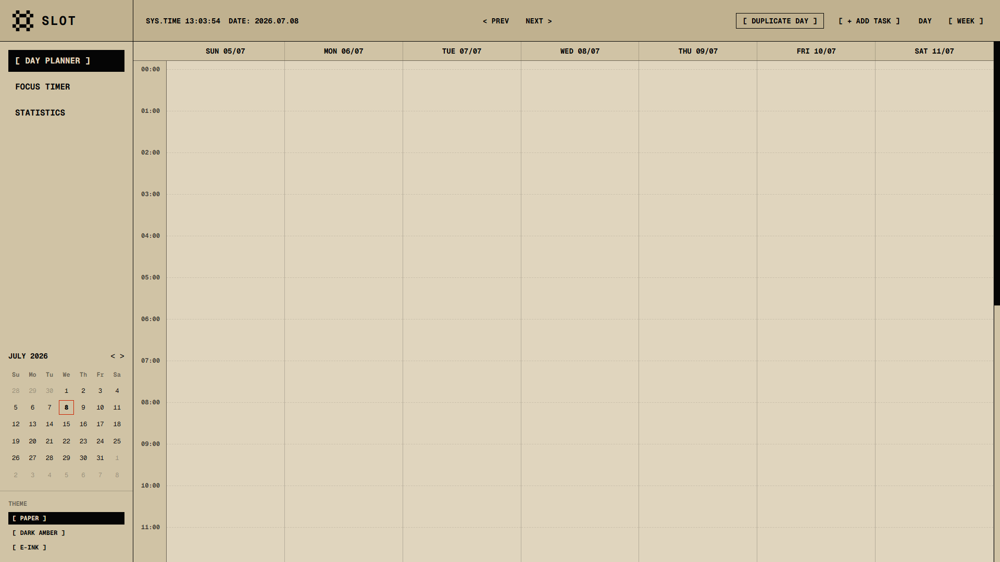

<p align="center">
  
</p>

<h1 align="center">S L O T</h1>

<p align="center">
  <strong>> SYS.INIT : TIME MANAGEMENT PROTOCOL ONLINE</strong>
</p>
<p align="center">
  A brutalist, offline-first time-blocking tool wrapped in a retro-futuristic terminal aesthetic.
</p>

<br/>

<p align="center">
  
</p>

## > OVERVIEW

**SLOT** is not just another calendar. It's a deeply intentional command center for your day. Built for developers, designers, and terminal enthusiasts, SLOT combines visual drag-and-drop time-blocking with a keyboard-first Command Line Interface (CLI). 

No cloud sync delays. No loading spinners. Your data lives exactly where it belongs: entirely on your local machine.

---

## > CAPABILITIES

### ?? Command Line Interface (CLI)
Why reach for a mouse when your hands are already on the keyboard? Press `~` or use the command bar to rapidly construct your day.
- `/add "Deep Work" 09:00 2h #focus` — Instantly blocks 2 hours.
- `/routine "Gym" 07:00 1h --daily` — Injects a virtual block every single day.
- `/note "Review PR #42"` — Appends a thought to your daily scratchpad.

### ??? Drag & Drop Matrix
Prefer visual organization? Grab blocks and snap them to the 15-minute grid. Resize them dynamically to adjust durations on the fly.

### ?? Daily Markdown Scratchpad
Every day gets a dedicated, collapsible drawer. Jot down meeting notes, sub-tasks, or code snippets with full GitHub-flavored Markdown support.

### ?? Focus Timer
Lock in. Switch to the dedicated Pomodoro mode with deep work duration presets. When time is up, authentic Web Audio API square-wave terminal beeps will pull you back to reality.

### ?? Telemetry & Heatmap
Track your execution. A GitHub-style 90-day heatmap visualizes your deep work consistency and task completion rates over time.

### ?? Responsive & PWA-Ready
Install SLOT directly to your desktop or mobile device. The layout gracefully shifts to a horizontal-scrolling timeline on phones, with absolute slide-over drawers to maximize screen real estate. 100% offline-capable via Service Workers.

### ?? Authentic Themes
- **PAPER**: High-contrast, brutalist black-on-beige.
- **DARK AMBER**: True AMOLED `#000000` background with piercing amber accents.
- **E-INK**: Monochromatic, distraction-free grayscale.

---

## > ARCHITECTURE

Built for zero-latency performance and absolute data privacy.

- **Engine**: [Next.js 15](https://nextjs.org/)
- **Styling**: [Tailwind CSS 4](https://tailwindcss.com/)
- **State & Persistence**: [Zustand](https://zustand-demo.pmnd.rs/) with `localStorage`
- **Interactions**: [dnd-kit](https://dndkit.com/)
- **Time Manipulation**: [date-fns](https://date-fns.org/)

---

## > INITIALIZATION

### Local Execution

```bash
git clone https://github.com/MukundhArul/slot.git
cd slot
npm install
npm run dev
```
Navigate to `http://localhost:3000` to access the terminal.

### Production Deployment

SLOT requires **zero backend configuration**. Because all state is handled locally via browser APIs, you can deploy it instantaneously to Vercel. 

[](https://vercel.com/new)

---

<p align="center">
  <i>> END OF FILE</i>
</p>
